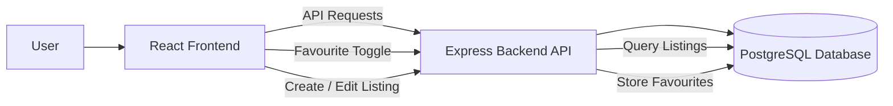

# Marketplace Platform

A full-stack marketplace platform built with **React**, **Express**, and **PostgreSQL**.  
Users can create listings, browse items, manage favourites, and interact through a secure, session-based authentication system.

The project focuses on clean architecture, strong data integrity, and scalable backend design.

## Tech Stack

- **Frontend:** React (Vite)
- **Backend:** Node.js, Express
- **Database:** PostgreSQL (users, listings, favourites, messages)
- **Auth:** Session-based authentication (cookies), role-based authorization
- **Database Access:** `pg` (node-postgres) with connection pooling
- **Deployment:** Single-domain (Express serves React build)

## Current Features

### Authentication & Authorization

- Session-based authentication
- Secure login/logout with hashed passwords
- Role-based authorization (admin-only routes)
- Auth session validation via `/api/auth/me`

### Marketplace Listings

- Create listings (authenticated users)
- Frontend CreateListing page
- Client-side validation
- Server-side validation + database constraints
- Browse listings with pagination
- Listing detail page (`/listings/:id`) with full listing info
- Owner-only edit listing
- Owner-only status toggle (active ↔ sold)
- Secure PATCH endpoint for status updates
- Owner-only delete listing
- Full CRUD implementation with ownership enforcement
- Reusable ListingCard component for listing UI

### Contact System

- Message storage
- Read/unread status
- Delete functionality
- Admin-protected access

### Favourites System

- Favourite / unfavourite listings
- Reusable FavouriteButton component
- MyFavourites page to view saved listings
- Instant UI updates when unfavouriting
- Dedicated REST API routes (`/api/favourites`)

### Architecture & Structure

- Clean separation of routes, middleware, and database layers
- Shared validation utilities
- React Router v6 with protected routes
- Layout component using `<Outlet />`
- One-domain production setup (no CORS in production)

## Architecture Overview

- **React** handles UI rendering and client-side state
- **Express** exposes RESTful APIs and serves the frontend build
- **PostgreSQL** stores users, listings, favourites, sessions, and messages
- **Session-based authentication** with server-side session storage
- Clear separation of concerns across frontend and backend layers
- RESTful route design (GET, POST, PUT, PATCH, DELETE)
- Ownership enforcement at the API layer for edit, status, and delete operations
- Partial updates implemented using PATCH for resource state changes

## System Architecture



### Frontend Architecture

- React Router v6 with centralized route definitions
- Layout component using `<Outlet />`
- Separation of pages, routes, and shared components
- AbortController for safe async request handling
- API abstraction via shared `apiFetch` utility
- ListingDetail page (accessible via `/listings/:id`)
- Clickable listings in Browse page
- Proper error handling for not found listings
- Reusable UI components (ListingCard, FavouriteButton)

## API Error Format

The API returns consistent error responses:

{
"error": "Listing not found"
}

Example HTTP codes:

- 400 — validation error
- 401 — unauthorized
- 403 — forbidden
- 404 — resource not found
- 500 — server error

## Database Schema (Simplified)

Users

- id
- email
- password_hash
- role

Listings

- id
- title
- description
- price_cents
- status
- owner_id
- created_at TIMESTAMPTZ

Favourites

- user_id
- listing_id

Messages

- id
- email
- message
- is_read

## API Design

The backend exposes RESTful APIs under `/api`.

Example routes:

- `POST /api/auth/login`
- `POST /api/auth/logout`
- `GET /api/auth/me`

Listings

- `GET /api/listings`
- `GET /api/listings/:id`
- `POST /api/listings`
- `PATCH /api/listings/:id/status`
- `DELETE /api/listings/:id`
- `PUT /api/listings/:id`

Favourites

- `POST /api/favourites/:id`
- `DELETE /api/favourites/:id`
- `GET /api/favourites`

## Security Considerations

- Passwords hashed using bcrypt
- Session cookies used for authentication
- Authorization checks enforce resource ownership
- Admin routes protected by role-based middleware
- Input validation at API layer
- Database constraints enforce data integrity

## Project Structure

```text
marketplace-platform/
├── backend/
│   ├── db/
│   │   └── database.js
│   ├── middleware/
│   │   ├── auth.js
│   │   └── session.js
│   ├── routes/
│   │   ├── admin.routes.js
│   │   ├── auth.routes.js
│   │   ├── contact.routes.js
│   │   ├── listings.routes.js
│   │   └── favourites.routes.js
│   ├── utils/
│   │   └── validation.js
│   └── index.js
│
├── frontend/
│   ├── src/
│   │   ├── api/
│   │   │   └── apiFetch.js
│   │   ├── components/
│   │   │   ├── AdminInbox.jsx
│   │   │   ├── ListingCard.jsx
│   │   │   └── FavouriteButton.jsx
│   │   ├── hooks/
│   │   ├── layouts/
│   │   │   └── Layout.jsx
│   │   ├── pages/
│   │   │   ├── CreateListing.jsx
│   │   │   ├── EditListing.jsx
│   │   │   ├── ListingsBrowse.jsx
│   │   │   ├── ListingDetail.jsx
│   │   │   ├── MyFavourites.jsx
│   │   │   └── Login.jsx
│   │   ├── routes/
│   │   │   ├── AppRoutes.jsx
│   │   │   ├── LoginRoute.jsx
│   │   │   ├── RequireAdmin.jsx
│   │   │   └── RequireAuth.jsx
│   │   ├── utils/
│   │   │   └── validateListings.js
│   │   ├── App.jsx
│   │   └── main.jsx
│   └── vite.config.js
│
└── README.md

```

## Future Improvements

- Image uploads for listings
- Search and filtering
- Category system
- Real-time messaging
- Cloud image storage (S3 / Cloudinary)
- Dockerized deployment

## Data Integrity & Validation

- Input validation at the API layer for clear user feedback
- Database-level constraints to guarantee data integrity
- Shared validation utilities to avoid duplication

## Why This Project

This project is designed with **production-grade architecture**, focusing on:

- clean architecture
- security best practices
- scalability
- maintainability
- production-minded design decisions

## Getting Started (Local Development)

### Backend

```bash
cd backend
npm install
npm run dev
```

### Frontend

```bash
cd frontend
npm install
npm run dev
```

## Author

### Randhir Multani
